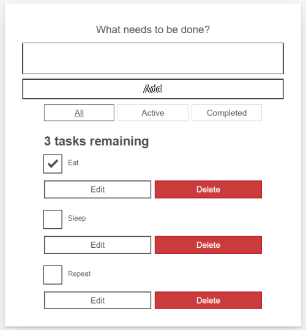

# dagger-demo🗡


---

Daggerは、日本語に訳すと短剣という意味です。  
由来は短剣のように使い勝手が良いツールだからですかね？（知らんけど、、、）  
ソフトウェアのビルド、テスト、デプロイを行う一連のCI/CDパイプラインをポータブルな開発キットです。  

* 公式  
  https://dagger.io/
* Github  
  https://github.com/dagger/dagger

---

## デモの流れ
* 🗡 ローカル環境を構築する
* 🗡 サンプルアプリをビルドする
* 🗡 サンプルアプリを実行する
* 🗡 サンプルアプリのビルド定義

---
# デモを行う

## 🗡 ローカル環境を構築する
Getting Started

https://docs.dagger.io/getting-started/

の手順に従ってセットアップする。（※Windows環境）

https://docs.dagger.io/1200/local-dev/

```
Invoke-WebRequest -UseBasicParsing -Uri https://dl.dagger.io/dagger/install.ps1 | Invoke-Expression
```
セットアップが完了すると下記メッセージが表示される。
```
Thank You for downloading Dagger!

-----------------------------------------------------
Dagger has been saved at <YOUR HOME FOLDER>/dagger/
Please add dagger.exe to your PATH in order to use it
----------------------------------------------------
```
ここでWindowsのユーザー環境変数（PATH）に 
dagger.exeがセットアップされたパスを追加してターミナル（もしくはIDE）を再起動する。

## 🗡 サンプルアプリをビルドする
Githubからサンプルをcloneする。

https://github.com/dagger/dagger

```
cd dagger
git checkout v0.2.8
```
（※もし起動してなければ）Docker Desktopを起動する。（※ちなバージョンは4.7.1）

サンプルアプリをbuildする。
```
cd pkg/universe.dagger.io/examples/todoapp
dagger do build
```
失敗、、、【0.2.9】以上のバージョンを使えと怒られました。（公式手順のとおりなのにw）
```
failed to load plan: package "dagger.io" is incompatible with this version of dagger (requires 0.2.9 or newer). Run `dagger project update` to resolve this
```
気を取り直してアップデートする。
```
dagger project update
Project updated

dagger version
dagger 0.2.9 (4fc38dac) windows/amd64
```
なんとなく胸騒ぎがするので一応cloneしたサンプルも同バージョンにしておく、、、
```
git checkout v0.2.9
```
【再度】サンプルアプリをビルドする。
```
dagger do build
```
（暫し待機、、、）初回実行時は思ったより時間かかる（約5分弱程）
```
[✔] actions.test.script                          0.5s
[✔] actions.deps                               197.9s
[✔] client.filesystem."./".read                  1.0s
[✔] actions.build.run.script                     0.7s
[✔] actions.test                                 2.8s
[✔] actions.build.run                           26.9s
[✔] actions.build.contents                       0.2s
[✔] client.filesystem."./_build".write           0.4s
```
ビルド成功！

ローカル環境のコンテナを確認するとdaggerのコンテナが居ることが分かります。
```
docker ps
CONTAINER ID   IMAGE                   COMMAND       CREATED          STATUS          PORTS     NAMES           
d033d42ec2b2   moby/buildkit:v0.10.2   "buildkitd"   12 minutes ago   Up 12 minutes             dagger-buildkitd
```
ちなみに、、、  
Docker Desktopが起動してないと下記のように実行エラーになります。（※ご注意をば）
```
dagger do build
3:43PM ERR failed to run docker: exit status 1    output=Client:
 Context:    default
3:43PM ERR failed to run docker: exit status 1    output=Client:
 Context:    default
 Debug Mode: falseuildx (Docker Inc., v0.8.1)
 Plugins:: Docker Compose (Docker Inc., v2.3.3)
  buildx: Docker Buildx (Docker Inc., v0.8.1)
  compose: Docker Compose (Docker Inc., v2.3.3)
  scan: Docker Scan (Docker Inc., v0.17.0)
ERROR: error during connect: This error may indicate that the docker daemon is not running.: Get "http://%2F%2F.%2Fpipe%2Fdocker_engine/v1.24/info": open //./pipe/docker_engine: The system cannot find the file specified.
Server:pretty printing info
ERROR: error during connect: This error may indicate that the docker daemon is not running.: Get "http://%2F%2F.%2Fpipe%2Fdocker_engine/v1.24/info": open //./pipe/docker_engine: The system cannot find the file specified.
errors pretty printing info

3:43PM FTL unable to create client: exit status 1
```

## 🗡 サンプルアプリを実行する
ビルド成功したアプリを実行する。
```
start _build/index.html
```
ちゃんとビルド出来てる。


【再々度】サンプルアプリをビルドする。
```
dagger do build
```
めちゃ速い。（daggerがダウンロード＆起動済みなので、、、）
```
[✔] actions.build.run.script                     0.1s
[✔] actions.test.script                          0.1s
[✔] actions.deps                                 1.1s
[✔] client.filesystem."./".read                  0.2s
[✔] actions.test                                 0.0s
[✔] actions.build.run                            0.0s
[✔] actions.build.contents                       0.0s
[✔] client.filesystem."./_build".write           0.3s
```

## 🗡 サンプルアプリのビルド定義
サンプルアプリのビルド定義ファイル【↓】を見てみる。

> pkg/universe.dagger.io/examples/todoapp/todoapp.cue

Googleが開発したCUE言語という独自の書式で記述しているのが興味深い。（YAML地獄から脱出するためらしい）

ただし、任意のプログラミング言語（シェルスクリプトあんど）でアクションを作成することも可能。

構成はAWSのCodebuildの `buildspec.yml` に似ている印象を受ける。（用途が同じだから当たり前だが）

新たにCUEの書き方を覚える必要はあるけれど、どの環境でも同じようにビルドできるのはありがたい。

ローカルで試せて同じ結果になることが保証されるのはうれしい。

うまく流行ればCI/CDのポータビリティが確保されロックインを避けられそう。（※現時点で正式リリース時期は未定）

```
package todoapp

import (
	"dagger.io/dagger"
	"dagger.io/dagger/core"
	"universe.dagger.io/alpine"
	"universe.dagger.io/bash"
	"universe.dagger.io/docker"
	"universe.dagger.io/netlify"
)

dagger.#Plan & {
	_nodeModulesMount: "/src/node_modules": {
		dest:     "/src/node_modules"
		type:     "cache"
		contents: core.#CacheDir & {
			id: "todoapp-modules-cache"
		}

	}
	client: {
		filesystem: {
			"./": read: {
				contents: dagger.#FS
				exclude: [
					"README.md",
					"_build",
					"todoapp.cue",
					"node_modules",
				]
			}
			"./_build": write: contents: actions.build.contents.output
		}
		env: {
			APP_NAME:      string
			NETLIFY_TEAM:  string
			NETLIFY_TOKEN: dagger.#Secret
		}
	}
	actions: {
		deps: docker.#Build & {
			steps: [
				alpine.#Build & {
					packages: {
						bash: {}
						yarn: {}
						git: {}
					}
				},
				docker.#Copy & {
					contents: client.filesystem."./".read.contents
					dest:     "/src"
				},
				bash.#Run & {
					workdir: "/src"
					mounts: {
						"/cache/yarn": {
							dest:     "/cache/yarn"
							type:     "cache"
							contents: core.#CacheDir & {
								id: "todoapp-yarn-cache"
							}
						}
						_nodeModulesMount
					}
					script: contents: #"""
						yarn config set cache-folder /cache/yarn
						yarn install
						"""#
				},
			]
		}

		test: bash.#Run & {
			input:   deps.output
			workdir: "/src"
			mounts:  _nodeModulesMount
			script: contents: #"""
				yarn run test
				"""#
		}

		build: {
			run: bash.#Run & {
				input:   test.output
				mounts:  _nodeModulesMount
				workdir: "/src"
				script: contents: #"""
					yarn run build
					"""#
			}

			contents: core.#Subdir & {
				input: run.output.rootfs
				path:  "/src/build"
			}
		}

		deploy: netlify.#Deploy & {
			contents: build.contents.output
			site:     client.env.APP_NAME
			token:    client.env.NETLIFY_TOKEN
			team:     client.env.NETLIFY_TEAM
		}
	}
}
```
